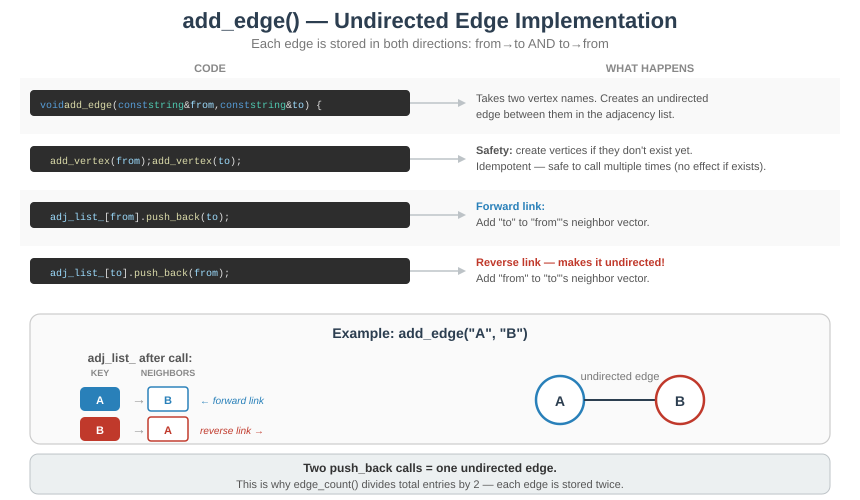
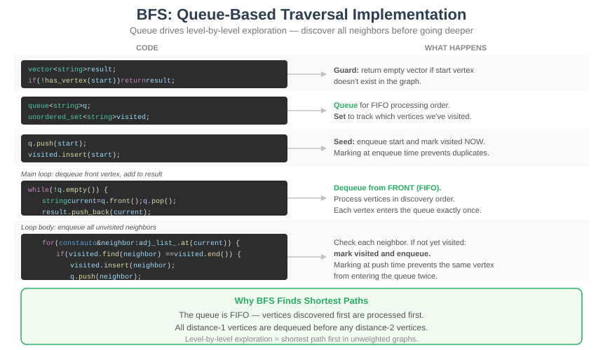
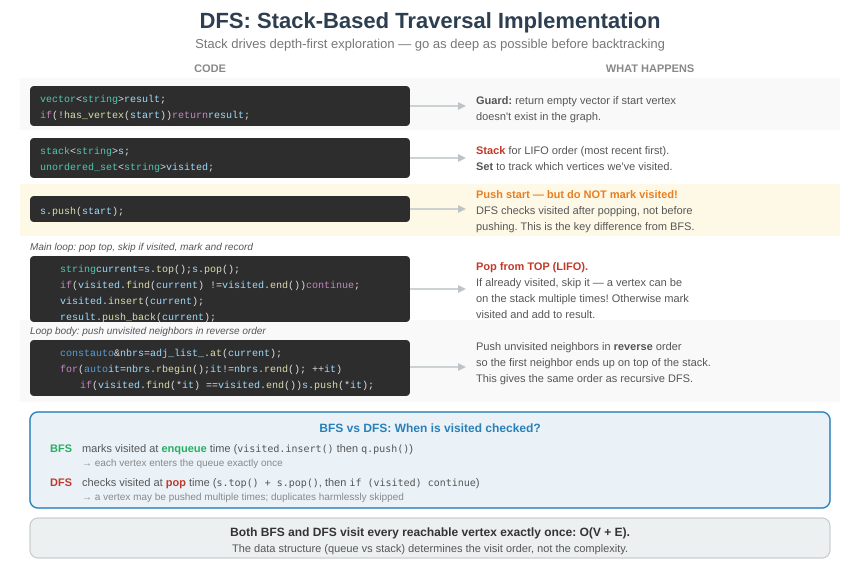

# CT17 -- Implementation Diagrams

Code-block diagrams referenced from `Graph.cpp`.

---

## 1. add_edge() — Undirected Edge
*`Graph.cpp::add_edge()` -- adding to both neighbor lists for an undirected graph*

---

## 2. BFS — Queue-Based Traversal
*`Graph.cpp::bfs()` -- queue drives level-by-level exploration*

---

## 3. DFS — Stack-Based Traversal
*`Graph.cpp::dfs()` -- stack drives depth-first exploration*

