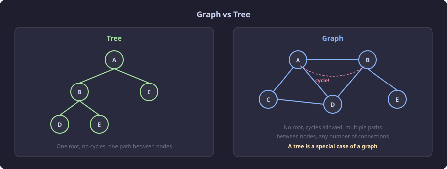
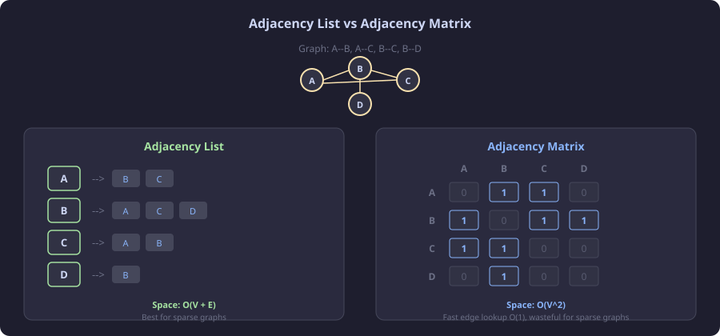
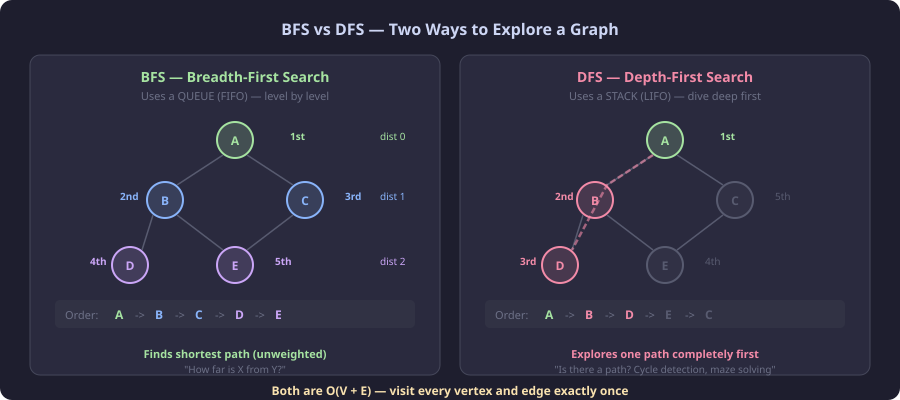

# CT17 -- Header Diagrams

Conceptual diagrams referenced from `Graph.h`.

---

## 1. What Is a Graph?
*`Graph.h` -- vertices (nodes) connected by edges (links) -- unlike trees, graphs can have cycles*

---

## 2. Adjacency List vs Adjacency Matrix
*`Graph.h` -- two ways to represent graph connections in code*

---

## 3. BFS vs DFS
*`Graph.h::bfs() / dfs()` -- two traversal strategies: level-by-level vs depth-first*

